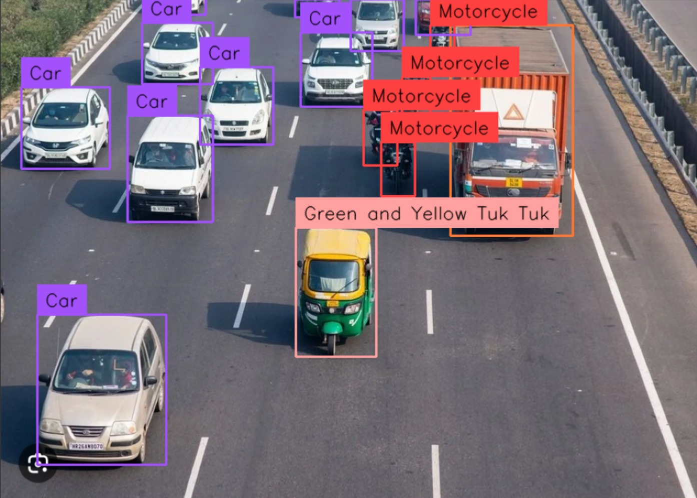

# 🚀 Traffic Counting with YOLOWorld 🚘

Welcome to the Traffic Counting with YOLOWorld project! This project uses the powerful YOLOWorld model from Ultralytics to detect and count various objects in images and videos, with a focus on traffic-related objects like cars, bikes, trucks, and more.

## 🌟 Features

- 💥 Utilizes the state-of-the-art YOLOWorld model for object detection
- 🖼️ Supports image and video processing
- 🚗 Customizable object classes for traffic-related objects
- 📹 Real-time video processing with annotated object detection
- 🚀 Leverages the Ultralytics and Supervision libraries for a smooth experience

## 🚀 Getting Started

1. Clone this repository to your local machine
2. Install the required dependencies (listed in the `requirements.txt` file)
3. Download the YOLOWorld model weights from the Ultralytics repository
4. Run the provided scripts for image and video processing

## 🎥 Demo

Want to see the magic in action? Check out this demo video showcasing the object detection capabilities of this project:

## 🤖 Contributing

We welcome contributions from the community! If you'd like to contribute to this project, please follow these steps:

1. Fork the repository
2. Create a new branch for your feature or bug fix
3. Make your changes and commit them with descriptive commit messages
4. Push your changes to your forked repository
5. Create a pull request, and we'll review your changes as soon as possible!

## 🙏 Acknowledgments

- [Ultralytics](https://github.com/ultralytics/ultralytics) for their incredible YOLOv8 model and library
- [Supervision](https://github.com/ultralytics/supervision) for the video processing utilities
- [NumPy](https://numpy.org/) for numerical computing

---
